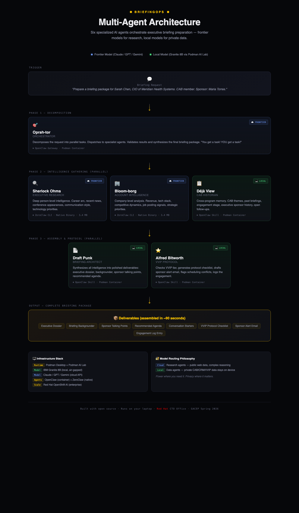

# BriefingClaw — Multi-Agent Executive Briefing Intelligence

> *"The connective tissue between your programs — automated."*

BriefingClaw is a multi-agent AI system that automates executive briefing preparation. Eight specialized agents orchestrate in parallel to transform a single briefing request into a complete intelligence package — executive dossier, company brief, sponsor talking points, recommended agenda, VVIP protocol checklist, sponsor readiness assessment, success probability verdict, and engagement log — in approximately 90 seconds.

Built for the **GACEP Spring 2026 Conference** session: *"One Customer, Many Doors: Aligning EBC, Advisory & Executive Programs for Maximum Impact"*

**Presenters**: Jan Mark Holzer (Red Hat CTO Office) & Kristin Waitkus

---

## Getting Started

Open `index.html` in a browser to navigate between all demo pages and resources. The navigation landing page links to both dashboards (original and Red Hat branded), the architecture diagram, the standalone persona gallery, the multi-contact briefing mode, the post-briefing feedback loop, the documentation set, and the enterprise deployment guide. It is the recommended entry point for first-time users and for orienting an audience at the start of a presentation.

---

## Table of Contents

- [Getting Started](#getting-started)
- [Why BriefingClaw](#why-briefingclaw)
- [Architecture Overview](#architecture-overview)
- [The Eight Agents](#the-eight-agents)
- [Execution Flow](#execution-flow)
- [Model Routing](#model-routing)
- [Technology Stack](#technology-stack)
- [Repository Structure](#repository-structure)
- [Demo Scenario](#demo-scenario)
- [Quick Start](#quick-start)
- [Documentation](#documentation)
- [Session Context](#session-context)

---

## Why BriefingClaw

Executive briefing preparation typically requires 4-6 hours of manual work per visitor: researching the executive, analyzing the company, reviewing past engagement history across disconnected systems (CRM, SAB records, EBC logs, ESP tracking), assembling documents, and coordinating VVIP protocol. Information silos between programs mean critical context gets lost — overdue commitments, unmet promises, relationship history.

BriefingClaw demonstrates that agentic AI can:

- **Collapse that 4-6 hour workflow into ~90 seconds**
- **Connect the dots across programs** that humans routinely miss (the "connective tissue")
- **Surface risk signals** like overdue action items before they become trust-destroying moments
- **Run entirely on a laptop** with no data leaving the device for sensitive operations

The system is not just about speed — it is about cross-program awareness that no single human consistently achieves across Executive Briefing Centers (EBC), Strategic Advisory Boards (SAB), and Executive Sponsorship Programs (ESP).

---

## Architecture Overview

BriefingClaw uses a hub-and-spoke multi-agent architecture. A central orchestrator decomposes requests and dispatches work to seven specialized agents across three execution phases.

> **Interactive diagram:** Open [`briefingclaw-architecture.html`](briefingclaw-architecture.html) in a browser for a detailed, interactive visualization of the architecture, execution flow, and infrastructure stack.



```
                          +-----------------+
                          |   Briefing      |
                          |   Request       |
                          +--------+--------+
                                   |
                          Phase 0: Trigger
                                   |
                          +--------v--------+
                          |   Oprah-tor     |
                          |  (Orchestrator) |
                          +--------+--------+
                                   |
                 Phase 1: Intelligence Gathering (parallel)
                    /              |              \
          +--------v---+   +------v------+   +----v--------+
          | Sherlock    |   | Bloom-borg  |   | Deja View   |
          | Ohms        |   | (Account    |   | (SAB        |
          | (Executive  |   |  Intel)     |   |  Historian) |
          |  Research)  |   +------+------+   +----+--------+
          +--------+---+          |                |
                    \             |               /
                     +------------+-------------+
                                  |
                 Phase 2: Assembly (parallel)
                /                  |                  \
    +----------v------+   +--------v-------+   +-------v--------+
    |  Draft Punk     |   | Alfred         |   | Sponsor Coach  |
    |  (Briefing      |   | Bitworth       |   | (Readiness     |
    |   Architect)    |   | (VVIP Protocol)|   |  Assessment)   |
    +----------+------+   +--------+-------+   +-------+--------+
                \                  |                  /
                 +-----------------+-----------------+
                                   |
                          Phase 3: Synthesis
                                   |
                          +--------v--------+
                          |  The Oddsfather |
                          |  (Success       |
                          |   Prediction)   |
                          +--------+--------+
                                   |
                          +--------v--------+
                          |   Complete      |
                          |   Briefing      |
                          |   Package       |
                          +-----------------+
```

---

## The Eight Agents

| # | Agent | Codename | Role | Model | Framework |
|---|-------|----------|------|-------|-----------|
| 1 | Orchestrator | **Oprah-tor** | Decomposes requests, dispatches agents, validates outputs, synthesizes final package. Enforces 25s hard timeouts on research agents with graceful degradation | Frontier (cloud) | OpenClaw Gateway |
| 2 | Executive Research | **Sherlock Ohms** | Deep person-level intelligence: career arc, recent activity, communication style, tech priorities | Frontier (cloud) | ZeroClaw CLI |
| 3 | Account Intelligence | **Bloom-borg** | Company-level intelligence: financials, tech stack, competitive landscape, strategic priorities | Frontier (cloud) | ZeroClaw CLI |
| 4 | SAB Historian | **Deja View** | Cross-program memory: SAB membership, past briefings, engagement stage, open follow-ups, SAB theme trend analysis | Local (Granite 8B) | OpenClaw Skill |
| 5 | Briefing Architect | **Draft Punk** | Document assembly: dossier, backgrounder, talking points, agenda, conversation starters | Local (Granite 8B) | OpenClaw Skill |
| 6 | VVIP Protocol | **Alfred Bitworth** | Operational protocol: VVIP tier, checklist, sponsor alerts, scheduling, engagement logging | Local (Granite 8B) | OpenClaw Skill |
| 7 | Sponsor Coach | **Sponsor Coach** | Readiness assessment micro-agent: scores sponsor preparation, flags coaching gaps, generates talking-point drills | Local (Granite 8B) | OpenClaw Skill |
| 8 | Success Prediction | **The Oddsfather** | Phase 3 synthesis: calculates briefing success probability, surfaces the verdict, identifies outcome risks and levers | Local (Granite 8B) | OpenClaw Skill |

### Agent Details

**Oprah-tor (Orchestrator)** — The air traffic controller. Parses incoming briefing requests, extracts key entities (visitor name, company, date, sponsor), dispatches work to the seven specialist agents in the correct phase order, enforces a 25-second hard timeout on the research agents with graceful degradation when the frontier network is flaky, validates that returned data meets quality thresholds, and synthesizes the final deliverable package.

**Sherlock Ohms (Executive Research)** — Performs deep web research on the visiting executive. Produces a profile covering career arc, recent public activity (last 6 months prioritized), technology priorities, communication style indicators, and personalized conversation starters. Every claim is sourced and confidence-rated.

**Bloom-borg (Account Intelligence)** — Researches the visitor's company. Delivers a structured brief covering business overview, financial highlights, recent news (last 90 days), technology landscape (derived from job postings and announcements), competitive dynamics, and strategic opportunities with briefing relevance.

**Deja View (SAB Historian)** — The "connective tissue" agent and the critical differentiator. Reads from internal program data (SAB meeting notes, CRM records, engagement history, VVIP roster) to build a cross-program relationship view. Identifies SAB membership, past briefing outcomes, overdue commitments, open follow-ups, and relationship stage progression. This agent catches what humans miss.

**Draft Punk (Briefing Architect)** — Synthesizes intelligence from all agents into five polished deliverables: (1) Executive Dossier (1-page quick reference), (2) Briefing Backgrounder (2-page comprehensive prep), (3) Sponsor Talking Points (for executive sponsor drop-in), (4) Recommended Agenda (time-blocked with rationales), (5) Conversation Starters (3 personalized openers).

**Alfred Bitworth (VVIP Protocol)** — Handles the operational layer. Determines VVIP tier (Platinum/Gold/Silver/Standard), generates a protocol checklist with assignees and deadlines, drafts a sponsor alert email, performs scheduling conflict checks, and creates an engagement log entry for future reference.

**Sponsor Coach** — A readiness assessment micro-agent that runs in parallel with Draft Punk and Alfred Bitworth. Scores the executive sponsor's preparation state (awareness of open commitments, familiarity with the visitor's recent moves, comfort with the SAB themes) and produces a short coaching brief: what to review, what to avoid, and the exact phrases that should show up in the sponsor drop-in. Designed to prevent the common failure mode where the sponsor walks in cold.

**The Oddsfather (Success Prediction)** — Phase 3 synthesis agent that runs after all Phase 2 deliverables are assembled. Reviews the full package, the critical flags, the engagement history trend, and the sponsor readiness score to generate a success probability verdict for the briefing (expressed as a percentage and a plain-language call). Surfaces the top three outcome risks and the top three levers that could shift the outcome. The Oddsfather's verdict is the final money moment of the pipeline.

---

## Execution Flow

**Input example:**
```
I have a briefing tomorrow with Sarah Chen, CIO of Meridian Health Systems.
She is a SAB member. Her sponsor is Maria Torres.
```

**Phase 0 — Trigger:** Request enters the OpenClaw Gateway (port 18789).

**Phase 1 — Intelligence Gathering (parallel):**
- Sherlock Ohms researches Sarah Chen via web (frontier model + Tavily search)
- Bloom-borg researches Meridian Health Systems via web (frontier model + Tavily search)
- Deja View queries internal data files for SAB records, past briefings, CRM data, VVIP status (local Granite model)

**Phase 2 — Assembly (parallel):**
- Draft Punk synthesizes all Phase 1 outputs into five documents (local Granite model)
- Alfred Bitworth generates protocol checklist and sponsor alert (local Granite model)
- Sponsor Coach produces the sponsor readiness score and coaching brief (local Granite model)

**Phase 3 — Synthesis:**
- The Oddsfather reviews the full package and generates the success probability verdict (local Granite model)
- Oprah-tor validates all outputs and assembles the final briefing package

**Output:** Complete briefing package with 10 deliverables plus critical flags and the success verdict:
- Executive Dossier
- Briefing Backgrounder
- Sponsor Talking Points
- Recommended Agenda
- Conversation Starters
- VVIP Protocol Checklist
- Sponsor Alert Draft
- Engagement Log Entry
- Sponsor Readiness Brief (Sponsor Coach)
- Success Probability Verdict (The Oddsfather)

---

## Model Routing

BriefingClaw uses a dual-model strategy that balances capability with data privacy:

| Tier | Model | Agents | Rationale |
|------|-------|--------|-----------|
| **Frontier (cloud)** | Claude / GPT / Gemini (configurable) | Oprah-tor, Sherlock Ohms, Bloom-borg | Complex reasoning, web search, multi-step research |
| **Local (on-device)** | IBM Granite 8B (via Podman AI Lab) | Deja View, Draft Punk, Alfred Bitworth, Sponsor Coach, The Oddsfather | Private data never leaves the laptop; structured tasks that fit a smaller model |

This split ensures that sensitive customer data (SAB records, CRM exports, VVIP preferences, engagement history) is processed exclusively by the local model. The frontier model only handles publicly available information gathered via web search.

---

## Technology Stack

| Component | Technology | Role |
|-----------|-----------|------|
| Local Model | IBM Granite 8B | Open-source LLM served locally via Podman AI Lab |
| Agent Framework (container) | OpenClaw | Gateway + skill-based agents (Oprah-tor, Deja View, Draft Punk, Alfred Bitworth) |
| Agent Framework (native) | ZeroClaw | Lightweight CLI agents (Sherlock Ohms, Bloom-borg) — ~3.4 MB binary |
| Containers | Podman | Rootless, daemonless container engine (Docker-compatible) |
| Web Search | Tavily API | Real-time web research for frontier agents |
| Enterprise Path | Red Hat OpenShift AI | Production-scale deployment (referenced, not required for demo) |

**Key properties:**
- **Fully open source** — every component from model to runtime
- **Laptop-portable** — runs on a MacBook Pro with 16 GB RAM
- **Air-gap capable** — local agents work without internet
- **No data exfiltration** — sensitive data processed only by the on-device model

---

## Repository Structure

```
gacep-demo/
|
+-- index.html                              Navigation landing page with persona gallery
+-- briefingclaw.sh                         Interactive CLI for demo management
+-- briefingclaw-dashboard.html            Live demo dashboard (original dark theme, improved readability)
+-- briefingclaw-dashboard-redhat.html     Live demo dashboard (Red Hat branded, improved readability)
+-- briefingclaw-architecture.html          Visual architecture diagram (HTML)
+-- briefingclaw-personas.html              Standalone filterable persona gallery (8 personas)
+-- briefingclaw-multicontact.html          Multi-contact group briefing mode (pick 2-5 of 9 contacts)
+-- briefingclaw-postbriefing.html          Post-briefing feedback loop with Oddsfather calibration
+-- README.md                              This file
|
+-- agents/                                Agent skill definitions
|   +-- orchestrator/SKILL.md              Oprah-tor: request decomposition & synthesis
|   +-- executive-research/SKILL.md        Sherlock Ohms: person-level web research
|   +-- account-intelligence/SKILL.md      Bloom-borg: company-level web research
|   +-- sab-historian/SKILL.md             Deja View: cross-program history lookup
|   +-- briefing-architect/SKILL.md        Draft Punk: document assembly
|   +-- vvip-protocol/SKILL.md             Alfred Bitworth: protocol & notifications
|   +-- sponsor-coach/SKILL.md             Sponsor Coach: readiness assessment
|   +-- oddsfather/SKILL.md                The Oddsfather: success probability verdict
|
+-- config/                                Infrastructure configuration
|   +-- env.example                        API key template (copy to .env)
|   +-- openclaw-config.yml                OpenClaw gateway & skill routing
|   +-- zeroclaw-config.toml               ZeroClaw agent profiles
|   +-- podman-compose.yml                 Container orchestration manifest
|
+-- demo-data/                             Simulated data for eight contact scenarios
|   +-- sab-meeting-notes.md               SAB meeting records (Q1 2026, Q4 2025, 8 contacts)
|   +-- crm-export.json                    CRM records (8 accounts, 20+ contacts)
|   +-- vvip-roster.json                   VVIP tiers & full preferences (8 contacts)
|   +-- engagement-history.md              Engagement timelines (8 complete narratives)
|
+-- demo-deliverables/                     Sample markdown reference files (7 files)
|   +-- sarah-chen/                        Dossier, agenda, VVIP checklist
|   +-- david-park/                        Dossier, agenda
|   +-- rachel-morrison/                   Dossier, agenda
|   Note: Key deliverables for all 8 contacts are embedded in the dashboards
|
+-- docs/                                  Extended documentation
    +-- ARCHITECTURE.md                    System design document
    +-- BUILD-GUIDE.md                     Step-by-step setup instructions
    +-- DEMO-SCRIPT.md                     Beat-by-beat presentation script
    +-- ENTERPRISE-DEPLOYMENT.md           Scaling from laptop to OpenShift AI
```

### Key Files Explained

**`index.html`** — Navigation landing page. Central launch point with a persona gallery (all 8 scenarios with thumbnails and tension summaries) and direct links to both dashboards, the architecture diagram, the documentation set, the enterprise deployment guide, and the GitHub repository. Open this first when demonstrating the system to someone new.

**`briefingclaw.sh`** — Interactive CLI wrapper for the entire demo lifecycle. Provides commands for setup, infrastructure startup, demo environment configuration, system health checks, preflight validation, standalone agent runs, rehearsal preview mode, and backup video recording. Designed so a non-technical presenter can operate the system.

**`briefingclaw-dashboard.html`** — Live demo dashboard with animated pipeline visualization (original dark theme). Optimized for projector readability with larger fonts and generous spacing between agent nodes. Features a contact dropdown selector with 8 scenarios (3 serious + 5 fun personas) and unique simulation timelines per contact. Risk badges appear on completed deliverable cards (red = critical, amber = warning, green = positive) so the audience can scan the outcome at a glance. Key deliverables for all 8 contacts are embedded as clickable modal content — click any completed card to view the full formatted document. Includes a PDF export button that produces a printable briefing package for any selected persona. A three-state mode badge in the header shows **LIVE** (all infrastructure responding), **LOCAL ONLY** (Granite 8B reachable but the OpenClaw gateway is not), or **SIMULATED** (no services responding). Session events are captured to localStorage telemetry — press **T** to download the full JSON log. The footer includes a GitHub repository link. Polls live infrastructure when running, falls back to animated simulation. `?autostart` URL parameter for hands-free launch. Keyboard: Space/Enter start, Escape reset, F fullscreen, T download telemetry.

**`briefingclaw-dashboard-redhat.html`** — Red Hat branded edition with identical functionality. Reskinned with Red Hat Display/Text/Mono fonts, PatternFly dark theme surfaces (#151515/#1F1F1F/#292929), Red Hat Red (#EE0000) primary accent, PatternFly blue for frontier agents, PatternFly teal for local agents. Same readability improvements, risk badges, PDF export, LIVE/LOCAL ONLY/SIMULATED mode detection, telemetry logging (T key), GitHub footer link, all 8 contact scenarios, and embedded deliverables. Use this version for Red Hat-affiliated presentations.

**`briefingclaw-architecture.html`** — Standalone HTML page with an interactive visualization of the multi-agent execution flow. Shows the four-phase pipeline (Phase 1 intelligence gathering; Phase 2 assembly; Phase 3 three-column assembly including Sponsor Coach; Phase 4 The Oddsfather synthesis), model routing decisions, and infrastructure stack. Useful as a visual aid during presentations.

**`briefingclaw-personas.html`** — Standalone persona gallery. Filterable card view of all 8 personas with tier and type filters, rich stat cards, color-coded drama callouts, top-3 priorities per persona, and action buttons (Run Demo to launch the dashboard for that persona, Open Dossier to jump straight to the deliverable view). Designed as a warm-up or reference page that attendees can browse before the main demo.

**`briefingclaw-multicontact.html`** — Multi-contact briefing mode. Pick 2-5 contacts from 9 total across 3 companies (Sarah Chen / Tom Richards / Dr. Priya Kapoor at Meridian, David Park / Karen Wu / Marcus Thompson at Apex, Rachel Morrison / Anil Desai / Frank Reeves at TerraScale). Outputs a shared company context, a buying center role matrix (economic / champion / technical / blocker / influencer), cross-contact dynamics (alignments / tensions / conflicts), a recommended briefing order (blocker first, champion last), a unified agenda, coordination risks, and The Oddsfather's group verdict with coordination adjustments. Self-contained with no backend.

**`briefingclaw-postbriefing.html`** — Post-briefing feedback loop. Form for logging briefing outcomes: contact dropdown, NPS score buttons (0-10), commitments list, actual outcome, relationship stage signal, and debrief notes. A live analysis panel on the right shows The Oddsfather's prediction calibration (predicted vs actual with drift classification), Deja View's relationship stage update preview, and recent submission history. Submissions persist to browser `localStorage` under the `briefingclaw-feedback` key (capped at 50 entries) so rehearsal data survives between sessions without any server.

**`docs/ENTERPRISE-DEPLOYMENT.md`** — Guide for scaling BriefingClaw from the laptop prototype shown in the demo to an enterprise deployment on Red Hat OpenShift AI. Covers reference architecture, multi-tenant considerations, governance controls, integration patterns with existing CRM and EBC tooling, and the migration path from OpenClaw/ZeroClaw to production agent runtimes.

**`config/env.example`** — Template for API keys. Supports multiple frontier providers (Anthropic, OpenAI, Google) and the Tavily web search API. The local Granite model requires no API key. Copy to `.env` and fill in your keys.

**`config/openclaw-config.yml`** — Configures the OpenClaw gateway: which skills to load, model routing overrides (frontier vs. local per agent), workspace file mounts, external agent invocation (ZeroClaw subprocesses), and tool permissions.

**`config/zeroclaw-config.toml`** — Configures ZeroClaw agent profiles for Sherlock Ohms and Bloom-borg: model provider, skill file path, iteration limits, and web search parameters.

**`config/podman-compose.yml`** — Container manifest for the OpenClaw service. Mounts agent skill files and demo data as read-only volumes, exposes the gateway on port 18789, and connects to the Granite model served by Podman AI Lab on port 8001.

---

## Demo Scenarios

The system includes eight demo scenarios, each showcasing different relationship challenges and cross-program intelligence patterns:

| Scenario | Contact | Company | Tier | Key Drama |
|----------|---------|---------|------|-----------|
| **Overdue Commitments** | Sarah Chen, CIO | Meridian Health Systems | Gold | AI governance architecture overdue from Feb SAB |
| **Retention Crisis** | David Park, SVP Technology | Apex Financial Group | Gold | Failed migration, Azure pitching, 3-month renewal |
| **Champion Under Stress** | Rachel Morrison, CTO | TerraScale Energy | Platinum | P1 outage damaged trust, board presentation in 30 days |
| **Viral Scaling Crisis** | Pepper Minton, CTO | SnackStack Technologies | Gold | Recipe AI went viral on TikTok, crashed production |
| **Win-Back / Re-engagement** | Ziggy Stardust-Chen, VP Platform Eng | Quantum Pretzel Corp | Silver | Left SAB feeling ignored, AWS courting, renewal at risk |
| **Security Blocker** | Luna Wavelength, CIO | GalactiCorp Space Industries | Platinum | $8M satellite deal blocked by CISO security audit |
| **Internal Politics** | Max Bandwidth, SVP Digital | Thunderbolt Logistics | Gold | AI pilot saved $4M but VP Ops blocking scale-up |
| **First Briefing** | Sage Cloudberry, CIO | WonderPaws Pet Wellness | Standard | Greenfield opportunity, evaluating Red Hat vs VMware |

Each scenario demonstrates cross-program intelligence across SAB records, EBC history, CRM data, support escalations, and VVIP protocol. The dashboard includes a contact dropdown to switch between all eight scenarios during a live demo.

---

## Quick Start

> Full step-by-step instructions: [`docs/BUILD-GUIDE.md`](docs/BUILD-GUIDE.md)

### Prerequisites
- macOS with Homebrew
- 16 GB RAM minimum, 30 GB free disk
- API key for at least one frontier provider (Anthropic, OpenAI, or Google)
- Tavily API key for web search

### Steps

```bash
# 1. Install dependencies
brew install podman podman-compose jq

# 2. Install Podman Desktop + AI Lab extension, download Granite 8B

# 3. Install ZeroClaw
curl -fsSL https://install.zeroclaw.dev | sh

# 4. Clone and configure
cp config/env.example config/.env
# Edit config/.env with your API keys

# 5. Start infrastructure
./briefingclaw.sh start

# 6. Run the demo
./briefingclaw.sh demo
# Or open http://127.0.0.1:18789 and type your briefing request
```

Alternatively, use the automated setup:
```bash
./briefingclaw.sh setup    # First-time configuration wizard
./briefingclaw.sh start    # Launch all infrastructure
./briefingclaw.sh demo     # Set up the demo environment
```

---

## Documentation

| Document | Purpose |
|----------|---------|
| [`docs/ARCHITECTURE.md`](docs/ARCHITECTURE.md) | Multi-agent system design, agent roster, execution flow, infrastructure stack |
| [`docs/BUILD-GUIDE.md`](docs/BUILD-GUIDE.md) | Complete setup instructions from prerequisites through conference-day checklist |
| [`docs/DEMO-SCRIPT.md`](docs/DEMO-SCRIPT.md) | Beat-by-beat presentation script with timing, narrative cues, and contingency plans |
| [`docs/ENTERPRISE-DEPLOYMENT.md`](docs/ENTERPRISE-DEPLOYMENT.md) | Scaling from laptop prototype to Red Hat OpenShift AI production deployment |
| [`USER-GUIDE.md`](USER-GUIDE.md) | Practical guide for operating BriefingClaw: installation, configuration, running demos, troubleshooting |

---

## Session Context

This system was designed for the **GACEP Spring 2026 Conference** session demonstrating how agentic AI can operationalize the "Program of Programs" framework — connecting Executive Briefing Centers, Strategic Advisory Boards, and Executive Sponsorship Programs through automated intelligence and cross-program awareness.

The demo shows that the tooling to build this kind of multi-agent system exists today, runs on commodity hardware, and uses entirely open-source components. The path from laptop prototype to enterprise deployment runs through Red Hat OpenShift AI.

---

*Built with open source. Runs on your laptop. No data leaves the building.*
